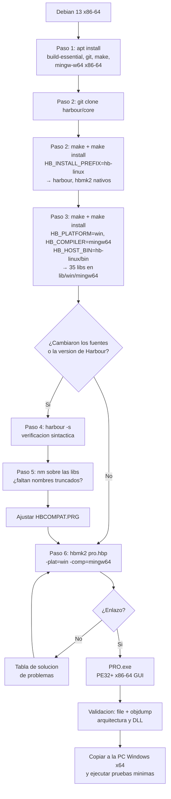

# Compilar PRO.exe desde Linux (compilación cruzada)

Documento de build & release del Sistema de Producción (PRO). Describe cómo
generar el ejecutable de 64 bits para Windows a partir de los fuentes de
este repositorio (rama `harbour`), compilando desde Linux con una toolchain
cruzada. El producto es el mismo que se obtiene en Windows: un `PRO.exe` de
64 bits **para Windows**. Linux sólo es la máquina donde se compila.

> Para compilar **en Windows** ver `COMPILAR_EN_WINDOWS.md`.
>
> Rutas: las carpetas `PruebaHarbour/`, `PROSRC/`, `PROHB/` y similares que se
> mencionan como evidencia pertenecen a la carpeta de trabajo original
> (`FuentePro Rescu5`) y **no están en este repositorio**.

---

## Índice

1. [Objetivo](#1-objetivo)
2. [Alcance](#2-alcance)
3. [Audiencia](#3-audiencia)
4. [Definiciones y acrónimos](#4-definiciones-y-acrónimos)
5. [Prerrequisitos](#5-prerrequisitos)
6. [Entorno de compilación](#6-entorno-de-compilación)
7. [Instalación de la toolchain cruzada (mingw-w64)](#7-instalación-de-la-toolchain-cruzada-mingw-w64)
8. [Instalación y configuración de Harbour](#8-instalación-y-configuración-de-harbour)
9. [Variables de entorno y rutas](#9-variables-de-entorno-y-rutas)
10. [Estructura de directorios](#10-estructura-de-directorios)
11. [Archivos de configuración del proyecto](#11-archivos-de-configuración-del-proyecto)
12. [Proceso paso a paso](#12-proceso-paso-a-paso)
13. [Compilación cruzada del ejecutable](#13-compilación-cruzada-del-ejecutable)
14. [Empaquetado y distribución](#14-empaquetado-y-distribución)
15. [Validación en Windows](#15-validación-en-windows)
16. [Scripts de automatización](#16-scripts-de-automatización)
17. [Solución de problemas](#17-solución-de-problemas)
18. [Diagrama de flujo](#18-diagrama-de-flujo)
19. [Registros y buenas prácticas](#19-registros-y-buenas-prácticas)
20. [Referencias](#20-referencias)
21. [Anexos](#21-anexos)
22. [Historial de cambios](#22-historial-de-cambios)
23. [Preguntas abiertas](#23-preguntas-abiertas)
24. [Checklist de replicabilidad](#24-checklist-de-replicabilidad)

---

## 1. Objetivo

Generar `PRO.exe`, ejecutable nativo de Windows x64 del Sistema de Producción,
a partir de los 124 módulos `.PRG` de este repositorio, usando Harbour 3.2 y
la toolchain cruzada mingw-w64 sobre Debian 13.

El ejecutable resultante reemplaza, en las PC de 64 bits, al `PRO.EXE` de
CA-Clipper 5.2c que solo funciona en DOS y en Windows de 32 bits (NTVDM).

## 2. Alcance

**Incluye:** construcción de Harbour desde el código fuente (nativo Linux y
cruzado a Windows x64), configuración del proyecto, compilación del ejecutable,
empaquetado y validación de arquitectura y dependencias.

**No incluye:** la versión CA-Clipper para DOS/XP (documentada en
la rama `main` de este repositorio), la versión con impresión a PDF, la
migración de datos, ni el despliegue en las PC de producción.

La compilación **nativa en Windows**, hecha en la máquina virtual
`Fasor-Win7x64`, se documenta en `COMPILAR_EN_WINDOWS.md`.

## 3. Audiencia

Desarrolladores y mantenedores del sistema, con manejo de línea de comandos en
Linux. No se requiere experiencia previa en Harbour ni en Clipper.

## 4. Definiciones y acrónimos

| Término | Significado |
|---|---|
| **Harbour** | Compilador libre del lenguaje xBase, compatible con CA-Clipper. Traduce `.prg` a C y luego compila con el compilador C del sistema. |
| **hbmk2** | Herramienta de construcción de Harbour. Lee un archivo de proyecto `.hbp`, invoca al compilador Harbour, al compilador C y al enlazador. |
| **`.hbp`** | Archivo de proyecto de hbmk2: opciones y lista de fuentes. |
| **`.ch`** | Cabecera de preprocesador de Harbour (equivalente a un `.h` de C). |
| **mingw-w64** | Toolchain GCC que genera binarios nativos de Windows. En cruzado, corre en Linux y produce `.exe`. |
| **Compilación cruzada** | Compilar en una plataforma (Linux x86-64) generando binarios para otra (Windows x86-64). |
| **GT** | *Graphic Terminal*: el controlador de pantalla de Harbour. `GTWVT` abre una ventana propia; `GTWIN` usa la consola de Windows. |
| **PE32+** | Formato de ejecutable de Windows de 64 bits. |
| **RDD** | *Replaceable Database Driver*: el motor de acceso a datos. Este programa usa `DBFNTX` (DBF + índices NTX), el de Clipper. |
| **CP850** | Página de códigos de DOS para español: acentos, eñe y caracteres de recuadro. |
| **NTVDM** | Subsistema de Windows de 32 bits que ejecuta programas DOS. No existe en Windows x64. |

## 5. Prerrequisitos

### 5.1 Hardware

| Recurso | Mínimo verificado |
|---|---|
| Arquitectura | x86-64 |
| Espacio en disco | 300 MB para Harbour (201 MB de código fuente y objetos + 76 MB instalados) + 20 MB del proyecto |
| RAM | [POR CONFIRMAR] — no se midió el pico; la compilación con `make -j8` se completó sin incidentes |

### 5.2 Software

Versiones exactas con las que se realizó y verificó el proceso:

| Componente | Versión | Origen |
|---|---|---|
| Debian GNU/Linux | 13 (trixie), kernel 6.12.105 | sistema base |
| GCC nativo | 14.2.0 (Debian 14.2.0-19) | paquete `build-essential` 12.12 |
| GNU Make | 4.4.1 | paquete `make` 4.4.1-2 |
| Git | 2.47.3 | paquete `git` |
| mingw-w64 GCC | 14-win32 (`gcc-mingw-w64-x86-64` 14.2.0-17+27) | paquete Debian |
| mingw-w64 binutils | 2.44-3 (`binutils-mingw-w64-x86-64`) | paquete Debian |
| mingw-w64 headers/CRT | 12.0.0-5 (`mingw-w64-x86-64-dev`, `mingw-w64-common`) | paquete Debian |
| Harbour | 3.2.1dev, revisión `r2609180937`, commit `8d94c31` | github.com/harbour/core |

Opcional, solo para validar sin Windows (ver [Anexo B](#anexo-b-verificación-sin-una-pc-windows)):

| Componente | Versión |
|---|---|
| Wine | 10.0 (Debian 10.0~repack-6) |
| Python | 3.13.5 |
| 7-Zip | 25.01 |

### 5.3 Permisos

| Acción | Permiso |
|---|---|
| Instalar paquetes Debian | root (`sudo apt install`) |
| Compilar Harbour e instalarlo en `$HOME` | usuario normal, **sin root** |
| Compilar el proyecto | usuario normal |

Harbour se instala dentro de `$HOME`, así que el proceso no requiere root salvo
para instalar los paquetes del sistema del paso 1.

### 5.4 Red

Se necesita acceso a internet solo para clonar Harbour desde GitHub
(`https://github.com/harbour/core.git`, ≈90 MB con `--depth 1`) e instalar los
paquetes Debian. El resto del proceso funciona sin conexión.

## 6. Entorno de compilación

El proceso corre íntegramente en una terminal de Linux. No se necesita entorno
gráfico para compilar (sí para la validación opcional con ventana, Anexo B).

```bash
sudo apt update
sudo apt install build-essential git make \
                 gcc-mingw-w64-x86-64 binutils-mingw-w64-x86-64 mingw-w64-x86-64-dev
```

Verificación del entorno:

```bash
gcc --version | head -1
x86_64-w64-mingw32-gcc --version | head -1
make --version | head -1
git --version
```

Salida esperada (las versiones pueden variar):

```
gcc (Debian 14.2.0-19) 14.2.0
x86_64-w64-mingw32-gcc (GCC) 14-win32
GNU Make 4.4.1
git version 2.47.3
```

## 7. Instalación de la toolchain cruzada (mingw-w64)

Los paquetes del paso anterior dejan la toolchain con el prefijo
`x86_64-w64-mingw32-`. Harbour la usa a través de la variable `HB_CCPREFIX`.

| Herramienta | Ejecutable |
|---|---|
| Compilador C | `x86_64-w64-mingw32-gcc` |
| Enlazador | `x86_64-w64-mingw32-ld` |
| Archivador | `x86_64-w64-mingw32-ar` |
| Inspección de binarios | `x86_64-w64-mingw32-objdump`, `x86_64-w64-mingw32-nm` |

Prueba mínima de la toolchain, independiente de Harbour:

```bash
printf '#include <stdio.h>\nint main(void){puts("ok");return 0;}\n' > /tmp/t.c
x86_64-w64-mingw32-gcc -o /tmp/t.exe /tmp/t.c && file /tmp/t.exe
```

Salida esperada:

```
/tmp/t.exe: PE32+ executable for MS Windows 5.02 (console), x86-64, 18 sections
```

> **Importante:** el paquete `mingw-w64-x86-64-dev` es imprescindible. Sin él, el
> compilador cruzado toma las cabeceras de `/usr/include` (las de glibc) y falla
> con `bits/libc-header-start.h: No such file or directory`.

## 8. Instalación y configuración de Harbour

Harbour no está empaquetado en Debian 13: hay que compilarlo. Se compila **dos
veces**, porque para generar un ejecutable de Windows desde Linux se necesita
primero el compilador Harbour nativo como herramienta anfitriona
(`HB_HOST_BIN`).

Las dos compilaciones se instalan **en el mismo árbol**, que es como hbmk2
espera encontrar las bibliotecas de cada plataforma:

```
hb-linux/
├── bin/        harbour, hbmk2, hbpp ...   (ejecutables Linux)
├── include/    cabeceras .ch y .h
└── lib/
    ├── *.a, libharbour.so                (bibliotecas Linux, 30 archivos)
    └── win/mingw64/*.a                   (bibliotecas Windows x64, 35 archivos)
```

Los comandos concretos están en el [paso a paso](#12-proceso-paso-a-paso)
(pasos 2 y 3).

## 9. Variables de entorno y rutas

### 9.1 Variables que usa la construcción de Harbour

| Variable | Valor usado | Para qué sirve |
|---|---|---|
| `HB_INSTALL_PREFIX` | `$HOME/.cache/pro-harbour/hb-linux` | Destino de la instalación. |
| `HB_PLATFORM` | `win` | Plataforma destino (solo en la etapa cruzada). |
| `HB_COMPILER` | `mingw64` | Compilador destino (solo en la etapa cruzada). |
| `HB_CCPREFIX` | `x86_64-w64-mingw32-` | Prefijo de la toolchain cruzada. |
| `HB_HOST_BIN` | `$HOME/.cache/pro-harbour/hb-linux/bin` | Harbour nativo que se usa como herramienta anfitriona. |
| `HB_BUILD_CONTRIBS` | `no` | Omite las bibliotecas de contribuciones: el proyecto no las usa y acortan el tiempo de compilación. |
| `HB_WITH_ZLIB` | `local` | Usa la zlib incluida en el código de Harbour, no la del sistema. |
| `HB_WITH_PCRE` | `local` | Ídem para PCRE. |
| `HB_WITH_CURSES` | `no` | Desactiva el GT de curses (solo Unix). |
| `HB_WITH_SLANG` | `no` | Desactiva el GT de slang (solo Unix). |
| `HB_WITH_X11` | `no` | Desactiva el GT de X11 (solo Unix). |
| `HB_WITH_GPM` | `no` | Desactiva el soporte de mouse de consola Linux. |

> **Las cuatro últimas y las dos de `local` son obligatorias en la etapa
> cruzada.** Sin ellas, la detección de componentes encuentra las bibliotecas y
> cabeceras de Linux, agrega `-I/usr/include` a la línea de compilación y mingw
> falla.

### 9.2 Conflicto con el entorno del usuario

El archivo `~/.bashrc` de esta máquina exporta variables de un intento anterior
de compilación cruzada que quedó a medias:

```bash
export HB_INSTALL_PREFIX=~/harbour_win32     # esa carpeta no existe
export HB_PLATFORM=win
export HB_COMPILER=mingw                     # 32 bits
```

hbmk2 las lee y las aplica antes que sus propios parámetros, lo que produce:

```
hbmk2: Processing environment options: -plat=win -comp=mingw
```

Por eso **todos los comandos de compilación del proyecto anteponen `env -u`**
para limpiarlas. Alternativa permanente: eliminar esas cuatro líneas del
`~/.bashrc`.

### 9.3 Rutas del proceso

| Ruta | Contenido |
|---|---|
| `~/.cache/pro-harbour/core` | Código fuente de Harbour (clon de git). |
| `~/.cache/pro-harbour/hb-linux` | Harbour instalado: Linux + Windows x64. |
| `<repo>` | Este repositorio, rama `harbour`: fuentes y configuración de la versión Harbour. |
| `<repo>`, rama `main` | Fuentes originales de Rescue5 (versión Clipper). No interviene en este proceso. |

`~/.cache` es persistente, pero no es un directorio de datos: si se limpia, hay
que rehacer los pasos 1 a 3. Para conservarlo, mover el árbol a otra ubicación e
indicarla con la variable `HB` de `compilar-linux.sh`.

## 10. Estructura de directorios

### 10.1 Del proyecto

```
Pro_Clipper/                   Repositorio (rama harbour)
├── *.PRG                      Los 124 módulos, adaptados a Harbour
├── HBMAIN.PRG                 Punto de entrada y ajustes de arranque
├── HBCOMPAT.PRG               Compatibilidad con el código descompilado
├── compat.ch                  Cabecera global
├── pro.hbp                    Proyecto de hbmk2
├── COMPILAR.BAT               Compilación en Windows
├── compilar-linux.sh          Compilación cruzada desde Linux
├── LEEME.TXT                  Qué cambió respecto de Clipper y por qué
├── README.md
└── docs/
    ├── COMPILAR_EN_LINUX.md   ← este documento
    ├── COMPILAR_EN_WINDOWS.md
    └── COMO_SE_ARMO_HARBOUR.txt
```

`PRO.exe` y la carpeta `.hbmk/` (objetos intermedios) se generan al compilar y
no se guardan en el repositorio (ver `.gitignore`).

### 10.2 De la toolchain

```
~/.cache/pro-harbour/
├── core/                      Código fuente de Harbour
├── hb-linux/                  Instalación (Linux + Windows x64)
├── build_linux.log            Registro de la etapa nativa
└── build_win64.log            Registro de la etapa cruzada
```

## 11. Archivos de configuración del proyecto

Los cuatro archivos son obligatorios. Los tres primeros son específicos de la
versión Harbour y no existen en la rama `main` (Clipper).

| Archivo | Obligatorio | Función |
|---|---|---|
| `pro.hbp` | Sí | Proyecto de hbmk2: nombre de salida, GT, cabecera global y lista de fuentes. |
| `compat.ch` | Sí | Cabecera que se incluye en todos los módulos (opción `-u`). |
| `HBMAIN.PRG` | Sí | Define `MAIN()` y fija bloqueo de archivos, página de códigos y título de ventana. |
| `HBCOMPAT.PRG` | Sí | Alias `DBCREATEIN()` y función `HBRUN()`. |

### 11.1 `pro.hbp`

```
# Proyecto Harbour - Sistema de Produccion (PRO)
# Destino: Windows x64, ventana propia (GTWVT)
#
#   hbmk2 pro.hbp            compila lo que cambio
#   hbmk2 pro.hbp -rebuild   compila todo de nuevo

-oPRO
-gtwvt
-w1
-ucompat.ch

*.PRG
```

| Opción | Efecto |
|---|---|
| `-oPRO` | Nombre del ejecutable: `PRO.exe`. |
| `-gtwvt` | Enlaza GTWVT y lo deja como controlador de pantalla por omisión: ventana propia, independiente de la consola de Windows. |
| `-w1` | Nivel de advertencias 1. |
| `-ucompat.ch` | Incluye `compat.ch` al principio de cada módulo. |
| `*.PRG` | Lista de fuentes. **En mayúsculas**: en Linux el comodín distingue mayúsculas y `*.prg` no encuentra nada. |

### 11.2 `compat.ch`

Desvía las llamadas `__RUN()` heredadas de DOS sin tocar los 124 módulos:

```clipper
/* -u reemplaza el juego de comandos estandar de Harbour: hay que volver a
   incluirlo para no perder REQUEST, SET, FOR EACH y demas. */
#include "std.ch"

#xtranslate __RUN( <cmd> )  =>  HBRUN( <cmd> )
```

> **Trampa:** la opción `-u` **sustituye** el juego de comandos por omisión
> (`std.ch`). Si `compat.ch` no lo vuelve a incluir, el compilador deja de
> reconocer `REQUEST`, `SET`, `FOR EACH` y similares.

### 11.3 `HBMAIN.PRG`

```clipper
#include "set.ch"
#include "dbinfo.ch"
#include "hbgtinfo.ch"

/* Harbour solo incluye en el ejecutable las paginas de codigos que se piden */
REQUEST HB_CODEPAGE_ES850

PROCEDURE MAIN()
   SET( _SET_DBFLOCKSCHEME, DB_DBFLOCK_CLIPPER )
   HB_CDPSELECT( "ES850" )
   HB_GTINFO( HB_GTI_CODEPAGE, 850 )
   HB_GTINFO( HB_GTI_WINTITLE, "Sistema de Produccion" )
   PRO()
RETURN
```

| Línea | Motivo |
|---|---|
| `PROCEDURE MAIN()` | Los fuentes descompilados no declaran `MAIN`: el programa empieza en `PRO()`. Harbour arranca por `MAIN`. |
| `REQUEST HB_CODEPAGE_ES850` | Sin este `REQUEST`, la página de códigos no se enlaza y `HB_CDPSELECT("ES850")` aborta en ejecución con `Error BASE/1302 Argument error: HB_CDPSELECT`. |
| `_SET_DBFLOCKSCHEME` | Usa el esquema de bloqueo de CA-Clipper, necesario para compartir los DBF por red con las PC que sigan usando el ejecutable de Clipper. |
| `HB_GTI_CODEPAGE, 850` | Hace que la ventana dibuje bien acentos, eñes y recuadros. |

### 11.4 `HBCOMPAT.PRG`

Contiene dos cosas:

1. **`DBCREATEIN()`**: CA-Clipper 5.2 trunca los nombres de función a 10
   caracteres, y así los emitió el descompilador. Harbour reconoce casi todos
   esos nombres cortos (`DBCLOSEARE`, `DBSELECTAR`, `ORDLISTCLE`, `READKILL`,
   `__REPORTFO`, `__SETCENTU`, `DBCOMMITAL`, `__XSAVESCR`, `__XRESTSCR`,
   `__MXRELEAS`); el único que falta se reenvía a `dbCreateIndex()`:

   ```clipper
   FUNCTION DBCREATEIN()
      RETURN HB_ExecFromArray( "DBCREATEINDEX", HB_AParams() )
   ```

2. **`HBRUN()`**: reemplaza las órdenes de DOS que el programa ejecutaba con
   `__RUN()`, porque en Windows moderno cada una abriría una ventana de consola:

   | Orden original | Tratamiento |
   |---|---|
   | `MODE LPT1:132` / `MODE LPT1:80` | Se ignora (ya no hay puerto paralelo). |
   | `DEL A*.` … `DEL R*.` | Se resuelve con `DIRECTORY()` + `FERASE()`. |
   | `MD <carpeta>` | Se resuelve con `HB_DirBuild()`. |
   | `CD` | Se ignora. |
   | Cualquier otra | Se pasa a `HB_RUN()`. |

> **Cuidado al agregar alias:** si se define una función que Harbour ya tiene,
> el enlazador aborta con `multiple definition of HB_FUN_<nombre>`. Antes de
> agregar un alias, verificar con `nm` (ver [paso 5](#paso-5-verificar-qué-nombres-truncados-faltan)).

## 12. Proceso paso a paso

### Paso 1: Instalar las dependencias del sistema

**Objetivo:** dejar disponibles GCC nativo, make, git y la toolchain cruzada.

```bash
sudo apt update
sudo apt install build-essential git make \
                 gcc-mingw-w64-x86-64 binutils-mingw-w64-x86-64 mingw-w64-x86-64-dev
```

**Salida esperada:** instalación sin errores. Verificar con los comandos de la
[sección 6](#6-entorno-de-compilación).

**Errores comunes**

| Error | Causa | Solución |
|---|---|---|
| `E: Unable to locate package gcc-mingw-w64-x86-64` | Índices de APT desactualizados | `sudo apt update` |
| `x86_64-w64-mingw32-gcc: command not found` | Falta el paquete o el PATH no se recargó | Reinstalar el paquete; abrir una terminal nueva |

---

### Paso 2: Compilar Harbour nativo (herramienta anfitriona)

**Objetivo:** obtener `harbour` y `hbmk2` para Linux. Son imprescindibles: en la
compilación cruzada, el compilador Harbour corre en Linux aunque el destino sea
Windows.

```bash
mkdir -p ~/.cache/pro-harbour && cd ~/.cache/pro-harbour
git clone --depth 1 https://github.com/harbour/core.git core

cd ~/.cache/pro-harbour/core
env -u HB_PLATFORM -u HB_COMPILER -u HB_INSTALL_PREFIX \
    HB_INSTALL_PREFIX=$HOME/.cache/pro-harbour/hb-linux \
    HB_BUILD_CONTRIBS=no \
    bash -c 'make -j"$(nproc)" && make install' 2>&1 | tee ../build_linux.log
```

**Explicación:** `env -u` descarta las variables del `~/.bashrc`
(ver [9.2](#92-conflicto-con-el-entorno-del-usuario)). `make` y `make install`
van encadenados con `&&`, **no** como `make -j8 install`.

**Salida esperada:** la cabecera del build debe indicar plataforma Linux:

```
! Building Harbour 3.2.1dev from source - https://harbour.github.io
! HB_INSTALL_PREFIX: /home/<usuario>/.cache/pro-harbour/hb-linux
! HB_PLATFORM: linux (x86_64) (auto-detected)
! HB_COMPILER: gcc (auto-detected: /usr/bin/)
...
! postinst script finished
```

Verificación:

```bash
~/.cache/pro-harbour/hb-linux/bin/harbour 2>&1 | head -1
~/.cache/pro-harbour/hb-linux/bin/hbmk2 -version | head -1
```

```
Harbour 3.2.1dev (r2609180937)
Harbour Make (hbmk2) 3.2.1dev (r2026-09-18 09:37)
```

Duración observada: ≈10 minutos con `make -j8`.

**Errores comunes**

| Error | Causa | Solución |
|---|---|---|
| `Fatal error: can't create pcredfa.o: No such file or directory` | Se ejecutó `make -j8 install` en un solo paso: la instalación y la compilación se pisan los directorios | Usar `make -j8 && make install` |
| `! HB_PLATFORM: win` en un build que debía ser nativo | Variables heredadas del `~/.bashrc` | Anteponer `env -u HB_PLATFORM -u HB_COMPILER -u HB_INSTALL_PREFIX` |

---

### Paso 3: Compilar Harbour cruzado para Windows x64

**Objetivo:** agregar al mismo árbol las 35 bibliotecas `.a` de Windows x64.

```bash
cd ~/.cache/pro-harbour/core
env HB_PLATFORM=win HB_COMPILER=mingw64 \
    HB_CCPREFIX=x86_64-w64-mingw32- \
    HB_HOST_BIN=$HOME/.cache/pro-harbour/hb-linux/bin \
    HB_INSTALL_PREFIX=$HOME/.cache/pro-harbour/hb-linux \
    HB_BUILD_CONTRIBS=no \
    HB_WITH_ZLIB=local HB_WITH_PCRE=local \
    HB_WITH_CURSES=no HB_WITH_SLANG=no HB_WITH_X11=no HB_WITH_GPM=no \
    bash -c 'make -j"$(nproc)" && make install' 2>&1 | tee ../build_win64.log
```

**Salida esperada:** la detección de componentes confirma que no se toman los de
Linux:

```
! HB_PLATFORM: win (x86_64)
! HB_COMPILER: mingw64
! Component: 'zlib' found in .../src/3rd/zlib (local)
! Component: 'pcre' found in .../src/3rd/pcre (local)
! Component: 'gpm' explicitly disabled
! Component: 'slang' explicitly disabled
! Component: 'curses' explicitly disabled
! Component: 'x11' explicitly disabled
```

Verificación:

```bash
ls ~/.cache/pro-harbour/hb-linux/lib/win/mingw64/*.a | wc -l   # 35
ls ~/.cache/pro-harbour/hb-linux/lib/win/mingw64 | grep -E "gtwvt|gtwin|rddntx"
```

```
libgtwin.a
libgtwvt.a
librddntx.a
```

Duración observada: ≈10 minutos con `make -j8`.

**Errores comunes**

| Error | Causa | Solución |
|---|---|---|
| `/usr/include/stdio.h:28: fatal error: bits/libc-header-start.h` al compilar `abs.c`, `gtsln.c` o `gtcrs.c` | La detección encontró zlib/PCRE/curses/slang del sistema y agregó `-I/usr/include` | Agregar `HB_WITH_ZLIB=local HB_WITH_PCRE=local HB_WITH_CURSES=no HB_WITH_SLANG=no HB_WITH_X11=no HB_WITH_GPM=no` |
| `! Warning: HB_HOST_BIN not specified. Could not find host native build.` | Falta el paso 2 o la ruta de `HB_HOST_BIN` es incorrecta | Completar el paso 2 y verificar que exista `hb-linux/bin/harbour` |

---

### Paso 4: Verificar la sintaxis de los fuentes

**Objetivo:** confirmar que los 126 módulos compilan antes de intentar enlazar.
`-s` hace solo verificación sintáctica, sin generar código.

```bash
cd "<repo>"
HB=~/.cache/pro-harbour/hb-linux
for f in *.PRG; do
  "$HB/bin/harbour" -q -s -n -w2 -i"$HB/include" "$f" 2>&1 | grep -E "Error [EF][0-9]+" \
    && echo "  ^ en $f"
done
echo "verificacion terminada"
```

**Salida esperada:** ningún `Error`; solo termina con `verificacion terminada`.

**Nota:** con `-w2` aparecen 9.792 advertencias `W0001 Ambiguous reference`.
Son normales: el código descompilado referencia campos de DBF sin prefijo y
Harbour resuelve igual que Clipper (primero campo, después variable de memoria).
Para verlas: quitar el `grep`.

---

### Paso 5: Verificar qué nombres truncados faltan

**Objetivo:** saber qué alias hay que definir en `HBCOMPAT.PRG`. Solo hace falta
repetirlo si se agregan módulos nuevos o se cambia de versión de Harbour.

```bash
cd ~/.cache/pro-harbour/hb-linux/lib/win/mingw64
for s in DBCREATEIN DBCOMMITAL __MXRELEAS __REPORTFO __SETCENTU \
         __XSAVESCR __XRESTSCR DBCLOSEARE DBSELECTAR ORDLISTCLE; do
  printf "%-14s %s\n" "$s" \
    "$(x86_64-w64-mingw32-nm -A *.a 2>/dev/null | grep -c " T HB_FUN_$s$")"
done
```

**Salida esperada:** `0` significa que falta y hay que definir el alias; ≥1 que
Harbour ya lo tiene y **no** hay que definirlo.

```
DBCREATEIN     0
DBCOMMITAL     2
__MXRELEAS     2
...
```

**Errores comunes**

| Error | Causa | Solución |
|---|---|---|
| `hbmk2: Error: Referenced, missing, but unknown function(s): X()` | Falta un alias | Agregarlo a `HBCOMPAT.PRG` con `HB_ExecFromArray()` |
| `multiple definition of 'HB_FUN_X'` | Se definió un alias que Harbour ya tiene | Quitarlo de `HBCOMPAT.PRG` |

---

### Paso 6: Compilar y enlazar el ejecutable

Ver la [sección siguiente](#13-compilación-cruzada-del-ejecutable).

## 13. Compilación cruzada del ejecutable

**Comando completo:**

```bash
cd "<repo>"
env -u HB_PLATFORM -u HB_COMPILER -u HB_INSTALL_PREFIX \
    HB_CCPREFIX=x86_64-w64-mingw32- \
    ~/.cache/pro-harbour/hb-linux/bin/hbmk2 pro.hbp -plat=win -comp=mingw64
```

O, equivalente y más corto:

```bash
./compilar-linux.sh          # incremental
./compilar-linux.sh todo     # completo (-rebuild)
```

**Qué hace hbmk2, en orden:**

1. Traduce cada `.PRG` a C con el compilador Harbour nativo.
2. Compila cada `.c` con `x86_64-w64-mingw32-gcc`.
3. Enlaza los objetos con las bibliotecas de `lib/win/mingw64`, en modo
   `-mwindows` (subsistema GUI, porque el GT por omisión es GTWVT).

**Salida esperada** (el final):

```
hbmk2: Compiling Harbour sources...
hbmk2: Compiling...
hbmk2: Linking... PRO.exe
```

**Producto:**

| Archivo | Valor observado |
|---|---|
| `PRO.exe` | 3.084.078 bytes |
| Tipo | `PE32+ executable for MS Windows 5.02 (GUI), x86-64, 18 sections` |
| MD5 | `a32812d49768c1a2c64dfdeabcfa4909` (cambia en cada reconstrucción) |

**Errores comunes**

| Error | Causa | Solución |
|---|---|---|
| `undefined reference to HB_FUN_PRO` y solo se compiló `HBMAIN.PRG` | El `.hbp` dice `*.prg` en minúsculas | Cambiar a `*.PRG` |
| `multiple definition of HB_FUN_MAIN` | `HBMAIN.PRG` aparece listado además del comodín | Dejar solo `*.PRG` en el `.hbp` |
| `syntax error at 'HB_CODEPAGE_ES850'` | `-ucompat.ch` reemplazó `std.ch` | Agregar `#include "std.ch"` en `compat.ch` |
| `hbmk2: Processing environment options: -plat=win -comp=mingw` | Variables del `~/.bashrc` | Anteponer `env -u ...` |

## 14. Empaquetado y distribución

`PRO.exe` se enlaza con las bibliotecas de Harbour **estáticas**. Las únicas DLL
que importa son las del propio Windows:

```bash
x86_64-w64-mingw32-objdump -p PRO.exe | grep "DLL Name" | sort -u
```

```
	DLL Name: ADVAPI32.dll
	DLL Name: GDI32.dll
	DLL Name: KERNEL32.dll
	DLL Name: msvcrt.dll
	DLL Name: USER32.dll
	DLL Name: WINMM.dll
```

**Consecuencia:** el paquete de distribución es un único archivo. No hay que
instalar Harbour, ni Visual C++ Redistributable, ni DLL auxiliares.

| Elemento | ¿Se distribuye? | Observación |
|---|---|---|
| `PRO.exe` | Sí | Único archivo necesario. |
| DLL de Harbour | No | Enlace estático. |
| Datos (`*.DBF`, `*.NTX`, `*.MEM`) | No | Están en el servidor; el programa pide disco y directorio al arrancar. |
| Instalador | No | [POR CONFIRMAR] — no se definió si habrá instalador o se copiará el archivo a mano. |

## 15. Validación en Windows

### 15.1 Verificación de arquitectura y dependencias

Desde Linux, antes de copiar el archivo:

```bash
file PRO.exe
x86_64-w64-mingw32-objdump -p PRO.exe | grep "DLL Name" | sort -u
```

En Windows (PowerShell):

```powershell
# Arquitectura: 'AMD64' = x64
(Get-Command .\PRO.exe).FileVersionInfo | Format-List
[System.Reflection.AssemblyName]::GetAssemblyName(".\PRO.exe") 2>$null
Get-Item .\PRO.exe | Select-Object Name, Length, LastWriteTime
```

### 15.2 Pruebas mínimas

| # | Prueba | Resultado esperado |
|---|---|---|
| 1 | Ejecutar `PRO.exe` | Abre una ventana titulada "Sistema de Produccion" y pide `CODIGO DEL USUARIO`. |
| 2 | Ingresar un código de usuario válido | Pide disco y directorio de trabajo, con los valores guardados en `ZDIS.MEM`/`WDIRECTO.MEM`. |
| 3 | Aceptar disco, directorio, mes y año | Muestra el menú principal con recuadros y la leyenda "Seleccione una opción" con el acento correcto. |
| 4 | Menú 6 → 4 (visualización de movimientos) | Muestra los movimientos del mes; los datos coinciden con los del ejecutable de Clipper. |
| 5 | Menú 8 (reconstrucción de índices) | Termina y vuelve al menú principal; los `.NTX` se regeneran. |
| 6 | Salir con `*` | Cierra sin dejar ventanas de consola abiertas. |

> **Antes de la prueba 5, respaldar los datos**: reescribe DBF e índices.

### 15.3 Validación en Windows 7 x64 (realizada)

El ejecutable se probó en una máquina virtual con **Windows 7 Home Premium SP1
de 64 bits**, con los datos reales y un usuario sin privilegios de
administrador. Resultado: arranca, abre su ventana, recorre menús, movimientos
y la consulta general de órdenes, y sale limpio.

La prueba encontró dos defectos del programa original, no de Harbour, que solo
se manifiestan en Windows moderno. Ambos se corrigieron y se volvieron a
probar:

| # | Síntoma | Causa | Corrección |
|---|---|---|---|
| 1 | `Error BASE/2006 Create error: F:\PRO      \ZDIS (DOS Error 3)` | El directorio de trabajo se guarda relleno a 9 caracteres. MS-DOS y XP ignoran los espacios al final de cada parte de la ruta; Windows 7+ no lo hace en las carpetas intermedias. | `MAIN.PRG` recorta el directorio antes de armar ninguna ruta. |
| 2 | `Error DBFNTX/1004 Create error: C:\BASURA.dbf (DOS Error 5)` | Los temporales se crean en la raíz de C:. Windows no permite crear archivos ahí sin elevación, **y no alcanza con dar permisos**. | Los temporales pasan a `C:\PROTMP`, que `HBMAIN.PRG` crea al arrancar. |

Comprobación del punto 2 en la propia máquina, tras otorgar escritura al grupo
Users sobre `C:\` con `icacls`:

```
crear carpeta en C:\                          -> OK
crear archivo  en C:\                          -> A required privilege is not held by the client
crear archivo dentro de una carpeta del usuario -> OK
```

Evidencia y detalle: `PruebaHarbour/win7x64/`.

### 15.4 Resultado de la validación en Linux

La validación se hizo en Linux (emulador DOS y Wine), comparando pantalla por
pantalla contra el ejecutable original de CA-Clipper sobre copias de los datos
reales. Detalle y evidencia en `../PruebaHarbour/RESULTADO.txt`. Resumen:

- 12 pantallas de menús y movimientos idénticas carácter por carácter.
- Reconstrucción de índices: 295 de 310 archivos idénticos; los DBF reescritos
  con los mismos registros.
- Convivencia verificada en ambos sentidos: cada versión lee los índices
  generados por la otra.

**No se ejecutó todavía en una PC real con Windows x64** (ver
[Preguntas abiertas](#23-preguntas-abiertas)).

## 16. Scripts de automatización

| Script | Plataforma | Uso |
|---|---|---|
| `compilar-linux.sh` | Linux | `./compilar-linux.sh [todo]` — compilación cruzada. |
| `COMPILAR.BAT` | Windows | `COMPILAR [TODO]` — compilación nativa con Harbour (`C:\hb32`) y MinGW-w64 (`C:\mingw64`) instalados en Windows. Probado en la VM `Fasor-Win7x64` el 2026-09-28; ver `COMPILAR_EN_WINDOWS.md`. |

`compilar-linux.sh` resuelve por sí solo los dos puntos delicados: limpia las
variables del `~/.bashrc` y fija `HB_CCPREFIX`.

```bash
#!/bin/bash
set -e

HB="${HB:-$HOME/.cache/pro-harbour/hb-linux}"
cd "$(dirname "$0")"

if [ ! -x "$HB/bin/hbmk2" ]; then
   echo "ERROR: no encuentro hbmk2 en $HB/bin"
   exit 1
fi

OPCION=""
[ "${1,,}" = "todo" ] && OPCION="-rebuild"

env -u HB_PLATFORM -u HB_COMPILER -u HB_INSTALL_PREFIX \
    HB_CCPREFIX=x86_64-w64-mingw32- \
    "$HB/bin/hbmk2" pro.hbp -plat=win -comp=mingw64 $OPCION
```

La variable `HB` permite usar otra instalación de Harbour:

```bash
HB=/opt/harbour ./compilar-linux.sh
```

## 17. Solución de problemas

| # | Síntoma | Causa | Solución |
|---|---|---|---|
| 1 | `Fatal error: can't create pcredfa.o` durante la construcción de Harbour | `make -j8 install` en un solo paso | `make -j8 && make install` |
| 2 | `bits/libc-header-start.h: No such file or directory` en la etapa cruzada | La detección tomó componentes de Linux | `HB_WITH_ZLIB=local HB_WITH_PCRE=local HB_WITH_CURSES=no HB_WITH_SLANG=no HB_WITH_X11=no HB_WITH_GPM=no` |
| 3 | `Warning: HB_HOST_BIN not specified` | Falta el Harbour nativo | Ejecutar el paso 2 |
| 4 | `hbmk2: Processing environment options: -plat=win -comp=mingw` | Variables exportadas en `~/.bashrc` | `env -u HB_PLATFORM -u HB_COMPILER -u HB_INSTALL_PREFIX` |
| 5 | Solo compila `HBMAIN.PRG`; `undefined reference to HB_FUN_PRO` | `*.prg` en minúsculas en el `.hbp` | Usar `*.PRG` |
| 6 | `multiple definition of HB_FUN_MAIN` | Módulo listado dos veces en el `.hbp` | Dejar solo el comodín |
| 7 | `Referenced, missing, but unknown function(s): DBCREATEIN()` | Falta el alias del nombre truncado | Definirlo en `HBCOMPAT.PRG` |
| 8 | `multiple definition of HB_FUN_DBCOMMITAL` | Alias innecesario: Harbour ya tiene esa función | Quitar el alias; verificar con `nm` (paso 5) |
| 9 | `syntax error at 'HB_CODEPAGE_ES850'` al compilar `HBMAIN.PRG` | `-u` reemplazó el juego de comandos estándar | `#include "std.ch"` dentro de `compat.ch` |
| 10 | En ejecución: `Error BASE/1302 Argument error: HB_CDPSELECT` | La página de códigos no está enlazada | `REQUEST HB_CODEPAGE_ES850` en `HBMAIN.PRG` |
| 11 | En ejecución: `Unrecoverable error 10001: Could not allocate console (output)` | Se ejecutó la variante de consola sin terminal asociada | Usar el ejecutable GTWVT, o ejecutar la variante de consola desde una terminal real |
| 12 | Acentos o recuadros mal dibujados | Página de códigos del GT distinta de 850 | `HB_GTINFO( HB_GTI_CODEPAGE, 850 )` en `HBMAIN.PRG` |

## 18. Diagrama de flujo



## 19. Registros y buenas prácticas

### 19.1 Registros

| Registro | Ruta | Cómo se genera |
|---|---|---|
| Construcción de Harbour nativo | `~/.cache/pro-harbour/build_linux.log` | `... \| tee ../build_linux.log` |
| Construcción cruzada | `~/.cache/pro-harbour/build_win64.log` | `... \| tee ../build_win64.log` |
| Compilación del proyecto | no se guarda por omisión | `./compilar-linux.sh 2>&1 \| tee compilar.log` |

Revisión rápida de un registro de Harbour:

```bash
grep -E "^! (HB_PLATFORM|HB_COMPILER|Component:)" ~/.cache/pro-harbour/build_win64.log
grep -i -c error ~/.cache/pro-harbour/build_win64.log
```

### 19.2 Buenas prácticas

- **Compilar siempre con `env -u`** mientras el `~/.bashrc` conserve las
  variables de la instalación win32 que quedó a medias.
- **Cada versión en su rama.** `main` es la de Clipper y `harbour` la de Harbour;
  comparten el código pero no la configuración de compilación.
- **Los cambios nuevos salen de `harbour`,** cada uno en su propia rama. Si además
  hay que llevarlos a la versión Clipper, se replican en `main`.
- **Verificar la arquitectura del binario** después de cada compilación: un
  error de `-comp=` produce un `.exe` de 32 bits que también funciona, pero no
  es lo que se pidió.
- **Guardar el registro** de las compilaciones de entrega.
- **Respaldar los datos antes de probar la opción 8** (reconstrucción de
  índices).

## 20. Referencias

| Recurso | Ubicación |
|---|---|
| Código fuente de Harbour | https://github.com/harbour/core |
| Documentación de hbmk2 | `~/.cache/pro-harbour/hb-linux/bin/hbmk2 -help`, y `doc/` del código fuente |
| Guía de la versión Harbour de este programa | `LEEME.TXT` |
| Resumen de la construcción de Harbour | `docs/COMO_SE_ARMO_HARBOUR.txt` |
| Compilación en Windows | `docs/COMPILAR_EN_WINDOWS.md` |
| Evidencia de validación | `PruebaHarbour/RESULTADO.txt` |
| Versión CA-Clipper para DOS/XP | `PROSRC/LEEME.TXT` |
| mingw-w64 | https://www.mingw-w64.org/ |

## 21. Anexos

### Anexo A: reconstrucción desde cero en una máquina nueva

```bash
# 1. Dependencias
sudo apt update
sudo apt install build-essential git make \
                 gcc-mingw-w64-x86-64 binutils-mingw-w64-x86-64 mingw-w64-x86-64-dev

# 2. Harbour nativo
mkdir -p ~/.cache/pro-harbour && cd ~/.cache/pro-harbour
git clone --depth 1 https://github.com/harbour/core.git core
cd core
env -u HB_PLATFORM -u HB_COMPILER -u HB_INSTALL_PREFIX \
    HB_INSTALL_PREFIX=$HOME/.cache/pro-harbour/hb-linux HB_BUILD_CONTRIBS=no \
    bash -c 'make -j"$(nproc)" && make install'

# 3. Harbour cruzado a Windows x64
env HB_PLATFORM=win HB_COMPILER=mingw64 HB_CCPREFIX=x86_64-w64-mingw32- \
    HB_HOST_BIN=$HOME/.cache/pro-harbour/hb-linux/bin \
    HB_INSTALL_PREFIX=$HOME/.cache/pro-harbour/hb-linux \
    HB_BUILD_CONTRIBS=no HB_WITH_ZLIB=local HB_WITH_PCRE=local \
    HB_WITH_CURSES=no HB_WITH_SLANG=no HB_WITH_X11=no HB_WITH_GPM=no \
    bash -c 'make -j"$(nproc)" && make install'

# 4. El proyecto
cd "<repo>"
./compilar-linux.sh todo
file PRO.exe
```

### Anexo B: verificación sin una PC Windows

Herramientas usadas para validar en Linux, por si hay que repetir la
comparación. No son necesarias para compilar.

| Herramienta | Versión | Para qué |
|---|---|---|
| Wine | 10.0 | Ejecutar el `.exe` de Windows en Linux. |
| emu2 (con parches locales) | commit del repositorio `dmsc/emu2` | Ejecutar el `PRO.EXE` original de DOS y obtener la referencia. |
| Python | 3.13.5 | Arnés de pruebas: pseudo-terminal, envío de teclas y captura de pantallas. |
| pyte | 0.8.2 | Interpretar la salida de la terminal y volcar la pantalla como texto. |
| python-xlib + Pillow | 0.33 / 11.1.0 | Enviar teclas y capturar la ventana GTWVT bajo X11. |
| 7-Zip | 25.01 | Extraer los datos de prueba del ISO. |

Método: se ejecuta el mismo recorrido de teclas en los dos ejecutables, sobre
copias idénticas de los datos reales, y se comparan las pantallas como texto con
`diff`. Detalle en `PruebaHarbour/RESULTADO.txt`.

Dos limitaciones encontradas, ajenas al programa:

1. Bajo emu2, el ejecutable de Clipper se queda sin memoria convencional en las
   consultas grandes, porque el emulador no ofrece memoria EMS.
2. Ni emu2 ni Wine recortan los espacios al final de los componentes de una ruta
   (`F:\PRO      \ZDIS.MEM`), cosa que DOS y Windows sí hacen. En las pruebas se
   resuelve con enlaces simbólicos.

### Anexo C: diferencias funcionales conocidas respecto de la versión Clipper

Estas diferencias son del programa, no del proceso de compilación. Están
desarrolladas en `LEEME.TXT`.

| # | Tema | Situación |
|---|---|---|
| 1 | Archivos temporales en la raíz de `C:` | **Resuelto.** Los temporales pasan a `C:\PROTMP`, que `HBMAIN.PRG` crea al arrancar. Ver sección 15.3. |
| 2 | Impresión por `LPT1` | Las órdenes `MODE LPT1:` ya no hacen nada. En esta versión **no hay salida a PDF**: la única impresión es `__RUN("TYPE C:\PROTMP\BASURA.TXT > PRN")`, que necesita una impresora en `LPT1`. El texto queda siempre en `C:\PROTMP\BASURA.TXT`. |
| 3 | Orden de listas con claves repetidas | Con claves iguales, Harbour no desempata como Clipper: las filas salen en otro orden. Los datos son los mismos. |
| 4 | `__RUN("DATE")` | Sigue abriendo el intérprete de comandos. |

## 22. Historial de cambios

| Versión | Fecha | Autor | Cambios |
|---|---|---|---|
| 1.0 | 2026-09-23 | Equipo de mantenimiento | Documento inicial. Describe el proceso tal como se ejecutó para generar `PRO.exe` (PE32+ x86-64, 3.093.550 bytes) con Harbour 3.2.1dev `r2609180937`. |
| 1.1 | 2026-09-24 | Equipo de mantenimiento | Validación en Windows 7 x64 real (sección 15.3). Dos correcciones en los fuentes de `PROHB`: recorte del directorio de trabajo y temporales en `C:\PROTMP`. |
| 1.2 | 2026-09-25 | Equipo de mantenimiento | Copia adaptada para `PROHB_SIN_PDF/`: mismo procedimiento aplicado a los 124 módulos de `PROSRC_SIN_PDF`. Se verificó que las reglas reproducen byte a byte los módulos de `PROHB`. Cambio adicional en `LIB.PRG`: `__RUN("TYPE C:\PROTMP\BASURA.TXT > PRN")`. |
| 1.3 | 2026-09-28 | Equipo de mantenimiento | Compilación nativa en la VM `Fasor-Win7x64`, documentada en `COMPILAR_EN_WINDOWS.md`. Responde la pregunta abierta 3. |
| 1.4 | 2026-09-30 | Equipo de mantenimiento | Pasa al repositorio `PRO-CLIPPER-SOURCE-CODE`, rama `harbour`, como `docs/COMPILAR_EN_LINUX.md`. Rutas adaptadas a la estructura del repositorio. |

## 23. Preguntas abiertas

| # | Pregunta | Estado |
|---|---|---|
| 1 | ¿Funciona en Windows 10 u 11? Se validó en Windows 7 x64 real (ver 15.3); 10 y 11 comparten el comportamiento que causó los dos defectos encontrados, pero falta confirmarlo. | [POR CONFIRMAR] |
| 2 | ¿Se deja `C:\PROTMP` como ubicación definitiva de los temporales, o se prefiere otra (por ejemplo una carpeta por usuario)? | [POR CONFIRMAR] |
| 3 | ¿`COMPILAR.BAT` funciona con el Harbour instalado en Windows (`C:\hb32`)? | [RESUELTO] Se probó en la VM `Fasor-Win7x64`; ver `COMPILAR_EN_WINDOWS.md`. |
| 4 | ¿Se va a fijar la versión de Harbour (un commit concreto) o se seguirá la rama principal? El proceso se validó con `8d94c31`. | [POR CONFIRMAR] |
| 5 | ¿Habrá instalador, o se distribuye copiando `PRO.exe`? | [POR CONFIRMAR] |
| 6 | ¿Cuál es el pico de RAM de la compilación? No se midió. | [POR CONFIRMAR] |
| 7 | ¿Se quitan del `~/.bashrc` las variables `HB_*` del intento win32, o se mantiene el `env -u` en los scripts? | [POR CONFIRMAR] |
| 8 | ¿Se mantiene también una variante de consola (GTWIN) además de la de ventana? | [POR CONFIRMAR] |

## 24. Checklist de replicabilidad

Marcar cada punto al reproducir el proceso desde cero en una máquina limpia.

**Entorno**

- [ ] Debian 13 x86-64 con al menos 300 MB libres.
- [ ] `build-essential`, `git` y `make` instalados.
- [ ] `gcc-mingw-w64-x86-64`, `binutils-mingw-w64-x86-64` y `mingw-w64-x86-64-dev` instalados.
- [ ] `x86_64-w64-mingw32-gcc` compila y enlaza el `.exe` de prueba de la sección 7.

**Harbour**

- [ ] `harbour/core` clonado; commit anotado en el registro de la entrega.
- [ ] Etapa nativa terminada: `hb-linux/bin/harbour` y `hb-linux/bin/hbmk2` existen y responden.
- [ ] Etapa cruzada terminada: `hb-linux/lib/win/mingw64` tiene 35 bibliotecas, entre ellas `libgtwvt.a` y `librddntx.a`.
- [ ] Ambos registros guardados (`build_linux.log`, `build_win64.log`).

**Proyecto**

- [ ] El repositorio (rama `harbour`) contiene los 124 `.PRG` del programa más `HBMAIN.PRG` y `HBCOMPAT.PRG`.
- [ ] `pro.hbp`, `compat.ch` y `compilar-linux.sh` presentes.
- [ ] `compat.ch` incluye `std.ch`.
- [ ] `HBMAIN.PRG` tiene `REQUEST HB_CODEPAGE_ES850`.
- [ ] Verificación sintáctica sin errores (paso 4).
- [ ] Comprobación con `nm` de los nombres truncados (paso 5).

**Producto**

- [ ] `./compilar-linux.sh todo` termina en `hbmk2: Linking... PRO.exe`.
- [ ] `file PRO.exe` informa `PE32+ ... x86-64`.
- [ ] `objdump -p` no muestra más DLL que las de Windows.
- [ ] El ejecutable abre su ventana y pide `CODIGO DEL USUARIO`.
- [ ] Las seis pruebas mínimas de la sección 15.2 pasan.
- [ ] Registro de la compilación guardado junto al entregable.
